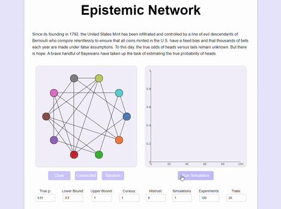
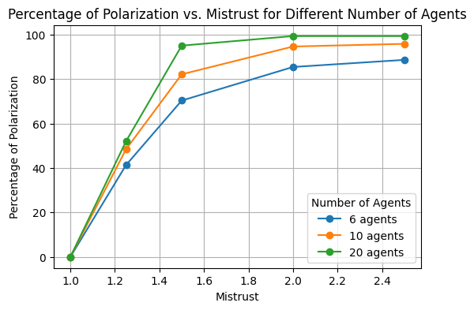

# Epistemic Network App

## Overview

This repository contains a web application written in JavaScript with a Python backend that simulates epistemic networks of Bayesian agents. These agents attempt to estimate a parameter by experimenting and sharing data only with their immediate neighbors over several simulation rounds.

The application allows users to configure and parameterize the network, observe the learning process, and analyze the agents' evolving beliefs.

Parameters such as `Curious` and `Mistrust` allow the user to explore network effects such as the **Zollman effect** or **polarization**.

## How Agents Learn

Say the parameter is the probability a given biased coin has landing heads. Each agent starts out with an initial estimate of `p = P(X = heads)` which follows a beta distribution `p ~ Beta(α, β)`.

The parameters `α` and `β` are assigned random values in the interval `[0, 20]`. Some will give a higher chance to heads, while others will favor tails.

During each round of the simulation, all agents:
- perform an experiment by tossing a fixed number `n` of coins and recording the observed number `k` of heads.
- share their data with their immediate neighbors in the network, who merge it with their own data.
- knowing that the data is generated by a binomial process, they use the conjugate solution for beta-binomial updating to adjust their estimates of `p` accordingly, so that their posterior estimate of `p` is described by a beta distribution with new parameters.

Repeating this process iteratively, the agents update their estimate of the probability of heads.

## UI Explanation

The user interface provides tools for configuring the network, running simulations, and visualizing the agents' learning process. Below is an example of the UI in action:

### Features

#### Left Plot (Network and Learning Process)
- **Visualization**: Displays the network structure and agents' learning during the simulation.
- **Interactivity**:
  - **Left double-click**: Activate or deactivate nodes.
  - **Left click beteen nodes**: Add or remove connections.
- **Buttons**:
  - **Clear Edges**: Removes all edges.
  - **Connected**: Connects all nodes.
  - **Random**: Initializes a randomly connected network.

#### Right Plot (Simulation Results)
- **Run Simulation**: Button to execute the simulation.
- **Graph**: Visualizes the agents' confidence that the parameter lies within the specified interval (`Lower Bound` and `Upper Bound`) over simulation rounds.

#### Parameters
- **`True p`**: The true value of the parameter to be estimated.
- **`Lower Bound` and `Upper Bound`**: Define the hypothesis interval for computing agents' confidence.
- **`Curious`**:
  - Value > 0: Agents always perform experiments.
  - Value = 0: Agents experiment only if their confidence in the hypothesis is ≥ 0.5.
- **`Mistrust`**:
  - Adjusts the weight of data received from neighbors with differing opinions.
  - Weight formula: `1 - min(1, mistrust * confidence_difference)`.
- **`Simulations`**: Number of independent runs to average results.
- **`Experiments`**: Total rounds of experimentation in each simulation.
- **`Trials`**: Number of trials performed by agents in a single experiment.

## The Zollman Effect

If the agents are `Curious`, they will ultimately converge on true beliefs. However, if they are not `Curious`, it is possible for all agents to abandon the research project if their confidence in a true hypothesis drops below 0.5. This can occur due to an unlucky streak of misleading data.

The surprising result is that this can lead **better-connected groups** to reach false consensus more often. This happens because all agents update on the same shared data, resulting in highly correlated beliefs.

In contrast, in **less-connected groups**, it is also possible for some members of the community to be led astray by misleading data. However, other agents are more likely to update on different data, keeping the research project alive. Eventually, these agents might bring the rest of the community back on track.

This phenomenon is known as the **Zollman Effect**. It states the counterintuitive result that for epistemically challenging problems, **less data sharing** might make research communities more likely to converge on the truth regarding a hypothesis.

## Polarization

The presence of `Mistrust` introduces a third alternative besides true consensus and a community abandoning research on a true hypothesis. When agents attach less weight to data from those they disagree with—or even completely ignore it—it can lead to a phenomenon we call `Polarization`.

In this scenario:
- Some agents reach true consensus.
- Others stop experimenting and updating their beliefs altogether, creating divided groups within the community.

The chart below illustrates how the likelihood of `Polarization` increases with the level of `Mistrust` and the size of the community.

